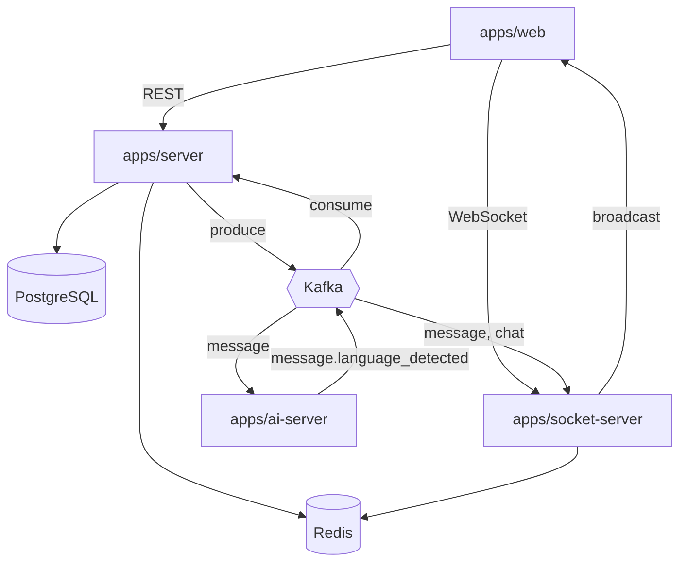

Integrantes do grupo: Guilherme Iago Schmidt Thomaz, Gustavo Oliveira Luquetti, Marcos Sousa de Paula da Mota Ribeiro, Yasmin Lopes de Moura

# SCD Server

Plataforma de chat em tempo real para o projeto **SCD — Sistemas Concorrentes e Distribuídos**.

O sistema foi pensado como uma aplicação distribuída: cada responsabilidade roda em um serviço separado, comunicando-se de forma assíncrona via Kafka e em tempo real via WebSockets. A detecção automática de idioma das mensagens é feita por um worker de IA desacoplado da API principal.

## Serviços

| Serviço | Stack | Responsabilidade |
|---------|-------|------------------|
| `apps/web` | Next.js, Tailwind | Interface de chat |
| `apps/server` | Go, Echo | API REST, persistência, filas de background (Asynq), consumer Kafka |
| `apps/socket-server` | Python, WebSockets | Entrega de eventos em tempo real para clientes conectados |
| `apps/ai-server` | Python, OpenAI | Detecção de idioma das mensagens |

## Estrutura do repositório

```
scd-server/
├── apps/
│   ├── server/          # API REST (Go)
│   ├── web/             # Frontend (Next.js)
│   ├── socket-server/   # WebSocket server (Python)
│   └── ai-server/       # Detecção de idioma (Python)
├── infra/
│   ├── kafka/           # Stack Kafka + Kafka UI
│   ├── redis/           # Stack Redis
│   └── terraform/       # Infraestrutura AWS
├── docs/api/            # Coleções de requisições por serviço
└── .github/workflows/   # Deploy automatizado por serviço
```

## Como funciona

O frontend se comunica com dois backends distintos:

- **REST** (`apps/server`) — CRUD de salas e mensagens, persistência e regras de negócio
- **WebSocket** (`apps/socket-server`) — notificações instantâneas para quem está na sala

Quando algo relevante acontece (nova mensagem, atualização de idioma, criação de sala), a API publica um evento no Kafka. Os demais serviços consomem esses eventos de forma independente, sem acoplamento direto entre si.



### Tópicos Kafka

| Tópico | Produtor | Consumidor |
|--------|----------|------------|
| `message` | server | ai-server, socket-server |
| `chat` | server | socket-server |
| `message.language_detected` | ai-server | server |

### Fluxo de uma mensagem

1. O cliente envia uma mensagem pela API
2. O `server` persiste no Postgres e publica no tópico `message`
3. O `ai-server` consome o evento, detecta o idioma via OpenAI e publica em `message.language_detected`
4. O `server` atualiza o idioma no banco e republica um `language_update` no tópico `message`
5. O `socket-server` consome os eventos de `message` e `chat` e faz broadcast para os clientes WebSocket na sala

## Produção

Em produção, a aplicação roda na **AWS** com serviços distribuídos em instâncias EC2 separadas, provisionadas via Terraform.

### Infraestrutura

| Componente | Onde roda | Papel |
|------------|-----------|-------|
| API (`server`) | 2× EC2 + ALB | Alta disponibilidade com balanceamento de carga |
| Frontend (`web`) | EC2 | Interface pública |
| WebSocket (`socket-server`) | EC2 | Conexões persistentes com clientes |
| AI (`ai-server`) | EC2 | Worker de detecção de idioma |
| Kafka | EC2 dedicada | Barramento de eventos entre serviços (KRaft, single node) |
| Redis | EC2 dedicada | Cache, pub/sub entre instâncias do socket-server e filas Asynq |
| PostgreSQL | RDS + read replica | Dados persistentes com réplica de leitura |

Todos os serviços de aplicação ficam na mesma VPC e se comunicam internamente. O Kafka expõe um listener **EXTERNAL** na porta `9094` para consumo entre EC2s; o Redis e o broker não são acessíveis publicamente.

### Deploy

Cada serviço tem seu próprio workflow no GitHub Actions. Ao fazer push na branch `main`, a imagem Docker correspondente é construída, publicada no Docker Hub e implantada via SSH na EC2 do serviço. O Kafka tem deploy manual, pois roda como infraestrutura dedicada.

Quando a instância do Kafka é recriada, o Terraform atualiza automaticamente o endereço do broker nos containers consumidores.

## Documentação da API

Coleções de requisições em `docs/api/`, organizadas por serviço:

- `docs/api/collections/server/` — REST API
- `docs/api/collections/socket-server/` — WebSocket
- `docs/api/collections/ai-server/` — Health checks

## Desenvolvimento Local 

Iniciar ambiente completo: 
`cd scd-server/infra`
`docker-compose up -d`
 
Frontend (web): [http://localhost:3001]
